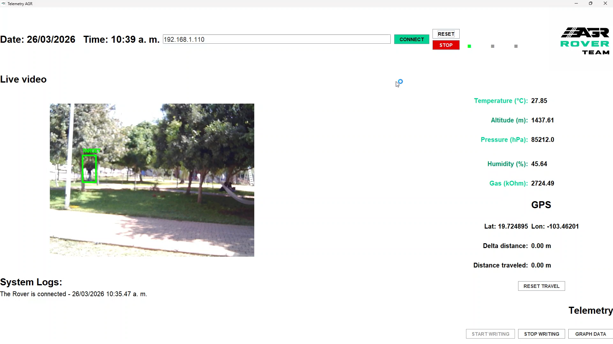

# IEEE_LowCostDataCollectionAndTelemetryTransmitter_CodePlacement
Resources and extra documentation for the manuscript "A low-cost platform to measure environmental and geographic positioning data" published in IEEE Latin America Transactions. 




1. **DCM**: Data Collection Module. In charge of collect sensor data.
2. **DTM**: Data Transmission Module. In charge of the creation and transmission of UDP packets.
3. **NEO 6M**: Wrapper of the NEO6M libary.
4. **Telemetry Center**: Desktop app to visualize real time telemetry and system logs
5. **images**: screenshots of the project

## Requirements

* Java 17 or newer
* OpenCV native library
* Haar Cascade XML files
* Network connection to the rover system

## Required Files

For the application to work correctly, the following files must be located **in the same folder**:

```
TelemetryCenter_jar.jar
opencv_java4120.dll
haarcascade_fullbody.xml
haarcascade_frontalface_alt.xml
```

If these files are not in the same directory, the application may fail to start or the person detection module may not work.

## Running the Application

Open a terminal in the folder where the files are located and run:

```
java -jar TelemetryCenter_jar.jar
```

## OpenCV Setup

The OpenCV native library (`opencv_java4120.dll`) must be accessible to Java. Placing the DLL in the same folder as the JAR is the simplest way to ensure it is found by the application.

